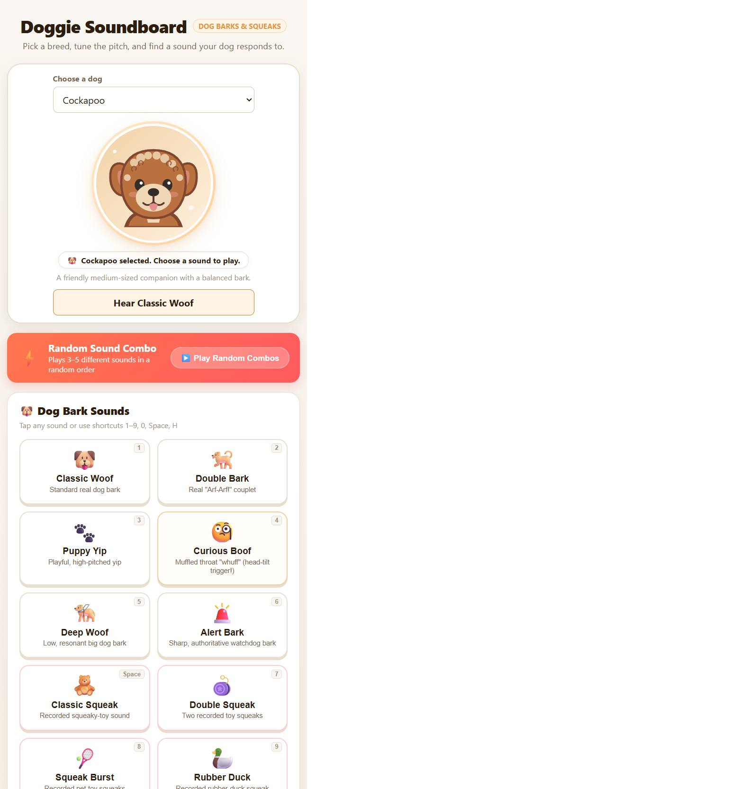

# Doggie Soundboard 🐶

An interactive dog soundboard with breed-selectable portraits, recorded bark samples, and playful squeaky-toy sounds.



Built with pure HTML5, CSS3, and the **Web Audio API** for responsive procedural sounds and recorded canine audio.

---

## 🚀 Quick Start

From the project directory, run the app over HTTP so local audio can load:

```bash
python3 server.py
```

---

## 🐾 Key Features

- **Breed selector**: Chihuahua, Cockapoo, German Shepherd, Bulldog, Pit Bull Terrier, Pembroke Welsh Corgi, and Jack Russell Terrier, each with an original generated illustration, featured bark sample, and pitch starting point.

### 1. 🐶 Dog Barks & Vocalizations
- **Classic Woof** and **Double Bark** from recorded dog samples.
- **Puppy Yip**, **Curious Boof**, **Deep Woof**, and **Alert Bark**.
- Select a breed to change the portrait, pitch starting point, and featured bark.

### 2. 🧸 Squeaky Toy Sounds
- **Classic Squeak**: Five-second squeaky-toy recording by PWLPL on Pixabay, free under the [Pixabay Content License](https://pixabay.com/service/license-summary/). [Source sound](https://pixabay.com/sound-effects/film-special-effects-squeaky-toy-377263/).
- **Double Squeak**: Repeats the one-second [Squeaky Toy #4](https://pixabay.com/sound-effects/film-special-effects-squeaky-toy-4-43608/) recording by Breviceps (Freesound) twice.
- **Squeak Burst**: Uses the five-second [Pet squeak toy](https://pixabay.com/sound-effects/film-special-effects-pet-squeak-toy-81315/) recording by Caitlin_100 (Freesound).
- **Rubber Duck**: Uses the seven-second [Rubber duck toy squeaking](https://pixabay.com/sound-effects/film-special-effects-rubber-duck-toy-squeaking-87897/) recording by panmaterac (Freesound).
- These sounds are free under the [Pixabay Content License](https://pixabay.com/service/license-summary/).
- **Wheezy Squeak**: Raspy, wavering toy squeak.
- Dog responses vary; try the options at different pitch settings.

### 3. 🎶 Recorded Dog Howl
- **Recorded Dog Howl**: Dog howl recording by CGEffex on Freesound, available under [CC BY 4.0](https://creativecommons.org/licenses/by/4.0/). [Source recording](https://freesound.org/people/CGEffex/sounds/158976/).

### 4. 🎛️ Sound Controls
- **Sound Frequency / Pitch Slider**: Adjust all sounds from lower (0.65x) through normal (1.00x) to higher (1.50x).
- **Master Volume**: Set playback volume.

### 5. ⚡ Random Sound Combos
- **Play Random Combos**: Plays 3–5 different soundboard options in a newly randomized order each time.
- Each sound finishes before the next begins; selecting another sound cancels the combo.

### 6. 🐾 Interactive Dog Portrait
- Dog portrait that tilts, perks its ears, and reacts to sounds.
- Tap the portrait to play a yip.

---

## ⌨️ Keyboard Shortcuts

| Key | Sound Trigger |
| :--- | :--- |
| `Space` | Classic Squeak |
| `1` | Classic Woof |
| `2` | Double Bark |
| `3` | Puppy Yip |
| `4` | Curious Boof |
| `5` | Deep Woof |
| `6` | Alert Bark |
| `7` | Double Squeak |
| `8` | Squeak Burst |
| `9` | Rubber Duck |
| `0` | Wheezy Squeak |
| `H` | Recorded Dog Howl |

## Sound Credits

Breed bark recordings are by AudioPapkin, UnairOnline, and Freesound contributors via Pixabay, used under the [Pixabay Content License](https://pixabay.com/service/license-summary/): [German Shepherd Bark](https://pixabay.com/sound-effects/nature-german-shepherd-barking-302356/), [Bulldog Bark](https://pixabay.com/sound-effects/nature-dog-barking-animal-sounds-bulldog-65485/), and [Terrier Bark](https://pixabay.com/sound-effects/nature-057308-yorkshire39s-terrier-barkm4a-38029/). The remaining profiles use shared dog-bark recordings already in the soundboard.
